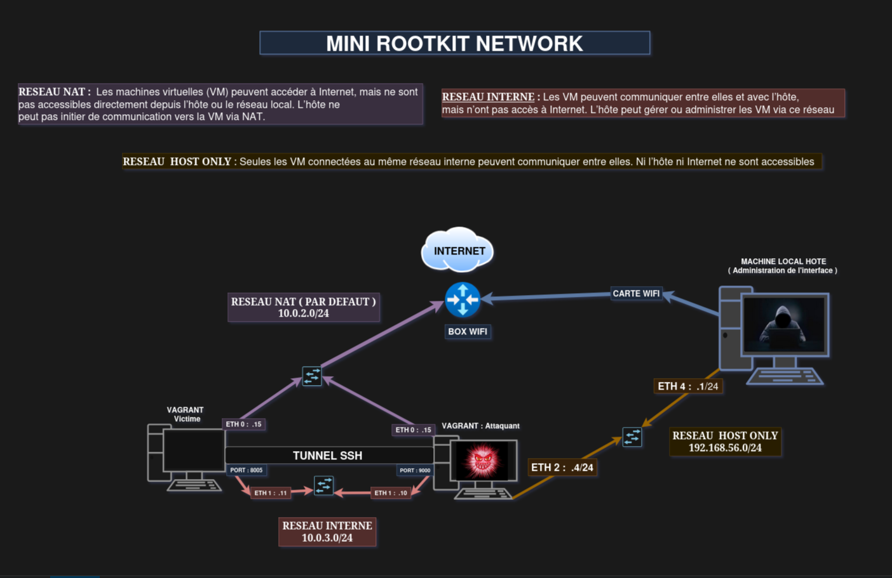
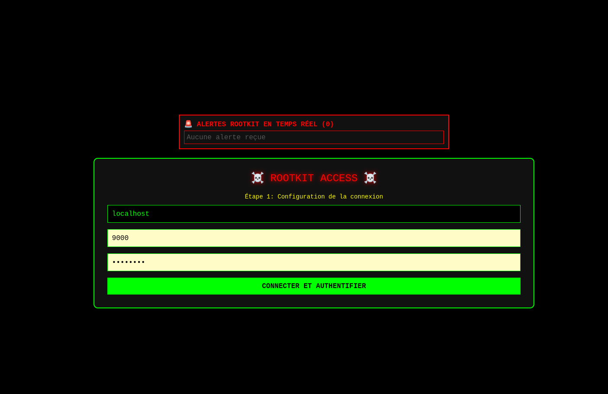
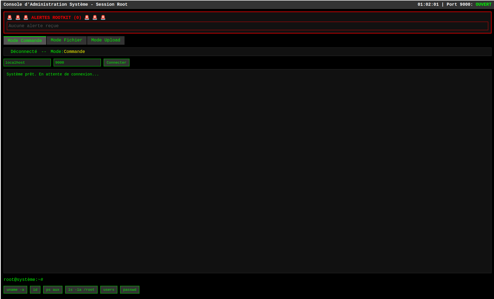

# README_attaquant

## 1. Introduction et Objectif 

Notre architecture globale se compose de deux éléments principaux : un module kernel rootkit installé sur la machine victime, et une interface de contrôle sur la machine attaquante. Cette conception client-serveur permet une administration discrète et efficace de la machine compromise, tout en maintenant une connexion sécurisée entre les deux entités.

Notre approche se concentre sur la création d'une interface utilisateur intuitive pour l'attaquant, permettant d'exécuter des commandes, de manipuler des fichiers et de maintenir un accès persistant à la machine victime, le tout en assurant un niveau de sécurité et de discrétion optimal.

## 2. Choix de l'interface et du port



*Schéma du réseau montrant les connexions entre la machine attaquante et la machine victime*

### 2.1 Pourquoi une interface dédiée ?

Nous avons opté pour le développement d'une interface dédiée (`interface9000.sh`) pour plusieurs raisons stratégiques :

- **Centralisation des fonctionnalités** : L'interface regroupe toutes les commandes et opérations possibles en un seul point d'accès, simplifiant considérablement l'administration de la machine compromise.
- **Discrétion opérationnelle** : Une interface dédiée permet de masquer la complexité des opérations sous-jacentes et de réduire les traces laissées sur le système attaquant.
- **Facilité d'utilisation** : L'interface graphique web permet une prise en main rapide et intuitive, même pour des utilisateurs non familiers avec les commandes shell spécifiques du rootkit.
- **Contrôle à distance** : Conçue pour fonctionner dans un contexte de réseaux distincts, l'interface permet de piloter le rootkit sans nécessiter une connexion directe au réseau de la victime.

Notre `interface9000.sh` est un script Python utilisant Flask qui crée une interface web permettant de:
- Visualiser en temps réel les alertes des machines infectées
- Établir une connexion avec le rootkit via authentification
- Exécuter des commandes à distance
- Transférer des fichiers entre les machines
- Visualiser les résultats des opérations

### 2.2 Gestion de l'authentification



L'authentification est un élément crucial pour la sécurité de notre système. Nous avons implémenté plusieurs mécanismes pour protéger l'accès au rootkit :

- **Authentification double niveau** : 
  1. L'interface web elle-même est protégée par un système d'authentification
  2. La connexion au rootkit nécessite un mot de passe dédié (`crystal2`)

- **Stockage sécurisé des identifiants** : Les mots de passe ne sont jamais stockés en clair mais hachés avec SHA-256

- **Session persistante** : Après authentification, les identifiants sont stockés dans une session sécurisée, évitant de devoir se réauthentifier à chaque commande

Cette approche multicouche permet d'éviter qu'une personne non autorisée puisse prendre le contrôle du rootkit, même si elle parvenait à accéder à l'interface attaquante.

### 2.3 Fonctionnalités de l'interface


Notre interface web permet d'accéder à un ensemble complet de fonctionnalités pour le contrôle de la machine victime, organisées en trois modes principaux:




#### Mode Commande
- Exécution de commandes shell avec récupération des sorties standard et d'erreur
- Boutons préconfigurés pour les commandes les plus courantes (`uname -a`, `id`, `ps aux`, etc.)
- Historique des commandes et de leurs résultats

#### Mode Fichier
- Lecture de fichiers distants (similaire à la commande `cat`)
- Affichage du contenu des fichiers avec formatage préservé
- Accès rapide aux fichiers système importants

#### Mode Upload/Download
- Upload de fichiers via WGET
- Possibilité de spécifier le chemin de destination
- Download de fichiers depuis la machine victime

#### Tableau de bord
- Affichage en temps réel des machines infectées
- Statut de la connexion (connecté/déconnecté)
- Informations sur le système cible (nom d'hôte, architecture, etc.)
- Statut du port de tunnel SSH (ouvert/fermé)

### 2.4 Implémentation technique de l'interface

Notre interface est basée sur le framework Flask, choisi pour sa légèreté et sa simplicité. Le fichier `interface9000.sh` contient:

1. **Backend Flask** : Gère les routes API pour:
   - Authentification (`/authenticate`)
   - Exécution de commandes (`/api/executer`)
   - Lecture de fichiers (`/api/lire`)
   - Upload/download de fichiers (`/api/store_file`, `/api/wget_download`, `/api/download_file`)
   - Surveillance des notifications (`/api/get_notifications`, `/api/receive_notification`)

2. **Frontend HTML/CSS/JavaScript** : 
   - Interface utilisateur inspirée des terminaux
   - Actualisation en temps réel via JavaScript
   - Onglets pour les différents modes
   - Indicateurs visuels de l'état de connexion

3. **Système de notifications** : 
   - Stockage des alertes envoyées par les rootkits
   - Mise en évidence des nouvelles notifications
   - Affichage des informations détaillées sur les machines compromises

L'ensemble est conçu pour être léger, rapide et fonctionnel même dans des environnements réseau restreints.

### 2.5 Tunnel SSH - Partie réseau

Dans un scénario d'attaque réel, l'attaquant et la victime se trouvent généralement sur des réseaux distincts, comme illustré dans le schéma réseau du sujet. Notre solution prend en compte cette réalité en implémentant un tunnel SSH pour sécuriser les communications.

Nous avons conçu le script `TUNNELSSH.sh` qui établit automatiquement un tunnel SSH entre la machine attaquante et la machine victime. Ce script utilise la commande :

```bash
ssh -N -f -L 9000:localhost:8005 vagrant@10.0.3.11
```

Cette commande :
- Lance SSH en mode non-interactif (`-N`)
- Met le processus en arrière-plan (`-f`)
- Crée un tunnel de redirection de port local (`-L`) qui relie le port 9000 de la machine attaquante au port 8005 de la machine victime

Ainsi, toutes les communications destinées au port 9000 sur la machine attaquante sont automatiquement redirigées vers le port 8005 de la machine victime, où le rootkit est à l'écoute.

### 2.6 Pourquoi le port 9000 ?

Le choix du port 9000 pour notre interface n'est pas arbitraire :

- **Port peu utilisé** : Le port 9000 n'est généralement pas associé à des services standards, ce qui réduit les risques de conflits
- **Apparence légitime** : Ce port est parfois utilisé pour des interfaces d'administration web, ce qui peut paraître normal pour un administrateur système non averti
- **Facilité mémorisation** : Le nombre rond (9000) est facile à retenir pour les opérateurs
- **Passage de pare-feu** : Ce port est souvent autorisé dans les configurations de pare-feu par défaut pour le trafic sortant

En cas de détection, l'activité sur ce port pourrait être facilement confondue avec une application web légitime, renforçant ainsi notre discrétion opérationnelle.

### 2.7 Avantages du tunnel SSH

L'utilisation d'un tunnel SSH présente plusieurs avantages majeurs pour notre opération :

- **Chiffrement des communications** : Toutes les données échangées entre l'attaquant et la victime sont chiffrées par SSH, empêchant leur interception et analyse
- **Contournement des restrictions réseau** : Le tunnel permet de traverser les pare-feu et les NAT qui pourraient bloquer les connexions directes
- **Masquage de l'origine** : L'adresse IP de l'attaquant est cachée derrière la connexion SSH
- **Authentification sécurisée** : L'utilisation des mécanismes d'authentification SSH (clés ou mot de passe) ajoute une couche de sécurité supplémentaire

Dans notre implémentation, l'interface se connecte à `localhost:9000` plutôt qu'à l'adresse IP réelle de la victime. Cette approche offre plusieurs avantages :

1. L'interface n'a pas besoin de connaître l'adresse IP réelle de la victime
2. Si l'adresse IP de la victime change, seule la configuration du tunnel doit être mise à jour
3. Les logs de l'interface ne révèlent pas l'adresse IP de la victime

### 2.8 Workflow complet d'une session d'attaque

1. **Préparation** :
   - Lancement du tunnel SSH via `TUNNELSSH.sh`
   - Démarrage de l'interface web via `interface9000.sh`

2. **Connexion** :
   - Accès à l'interface web (http://192.168.56.4:5000)
   - Configuration des paramètres de connexion (localhost:9000)
   - Authentification avec le mot de passe du rootkit

3. **Contrôle de la machine** :
   - Exécution de commandes arbitraires via le Mode Commande
   - Consultation de fichiers système via le Mode Fichier
   - Transfert de fichiers via le Mode Upload/Download

4. **Surveillance** :
   - Monitoring des alertes de nouveaux rootkits installés
   - Vérification du statut de la connexion
   - Analyse des informations système de la machine victime

Cette architecture en tunnel SSH correspond parfaitement à un scénario d'attaque réel où l'attaquant et la victime ne se trouvent pas sur le même réseau, comme illustré dans le schéma réseau fourni avec le sujet.

## 3. Détails techniques de l'implémentation

### 3.1 Structure du code de l'interface

Le script `interface9000.sh` est organisé en plusieurs sections:

1. **Initialisation et configuration** :
   - Importation des bibliothèques nécessaires
   - Configuration de Flask et des variables globales
   - Initialisation du dossier de stockage des fichiers uploadés

2. **Routes d'interface utilisateur** :
   - `/` : Page principale qui affiche soit l'interface d'authentification, soit l'interface de contrôle
   - `/auth_page()` : Génère le HTML pour la page d'authentification
   - `/main_interface()` : Génère le HTML pour l'interface principale de contrôle

3. **Routes API** :
   - `/api/receive_notification` : Endpoint pour recevoir les alertes des rootkits
   - `/api/verifier_port` : Vérifie si le port du tunnel SSH est ouvert
   - `/authenticate` : Gère l'authentification avec le rootkit
   - `/api/get_notifications` : Récupère la liste des notifications
   - `/api/executer`, `/api/lire` : Exécution de commandes et lecture de fichiers
   - `/api/store_file`, `/api/download_file`, `/api/wget_download` : Gestion des transferts de fichiers

4. **Fonctions utilitaires** :
   - `envoyer_commande()` : Gère la communication avec le rootkit
   - Diverses fonctions de traitement des fichiers et des réponses

### 3.2 Protocole de communication

La communication entre l'interface et le rootkit suit un protocole simple mais efficace:

1. **Établissement de connexion** :
   - Le client se connecte au rootkit sur le port spécifié
   - Le rootkit répond avec "AUTH_REQUIRED"
   - Le client envoie "AUTH [mot_de_passe]"
   - Le rootkit répond "AUTH_OK" ou "AUTH_FAILED"

2. **Commandes** :
   - Format: "EXEC [commande]" pour exécuter une commande shell
   - Format: "LIRE [chemin]" pour lire un fichier
   - Format: "UPLOAD [nom] [méthode] [chemin]" pour préparer un upload

3. **Réponses** :
   - Les réponses sont envoyées en texte brut
   - Pour les commandes, la sortie standard et d'erreur sont capturées
   - Pour les fichiers, le contenu est renvoyé tel quel

4. **Gestion des erreurs** :
   - Les erreurs sont préfixées par "Erreur:"
   - Les timeouts sont gérés avec des tentatives multiples

Ce protocole simple permet une implémentation légère tout en couvrant toutes les fonctionnalités nécessaires.

## 4. Conclusion

Notre interface d'attaque représente une solution complète pour le contrôle à distance d'une machine compromise par notre rootkit. Grâce à une interface web intuitive et à un tunnel SSH sécurisé, nous pouvons administrer discrètement la machine victime depuis n'importe quel réseau, tout en maintenant un niveau élevé de sécurité et de furtivité.

L'interface a été conçue pour être à la fois puissante et facile à utiliser, permettant même à des utilisateurs moins expérimentés de tirer pleinement parti des capacités du rootkit. Le tunnel SSH ajoute une couche de sécurité supplémentaire, rendant les communications pratiquement indétectables et résistantes à l'analyse.

Cette approche représente un équilibre optimal entre fonctionnalité, sécurité et facilité d'utilisation, correspondant parfaitement aux exigences du projet et aux scénarios d'attaque réels.
